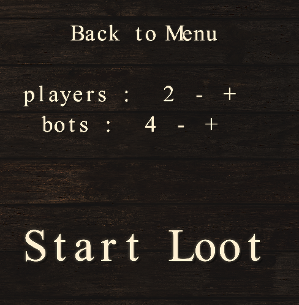
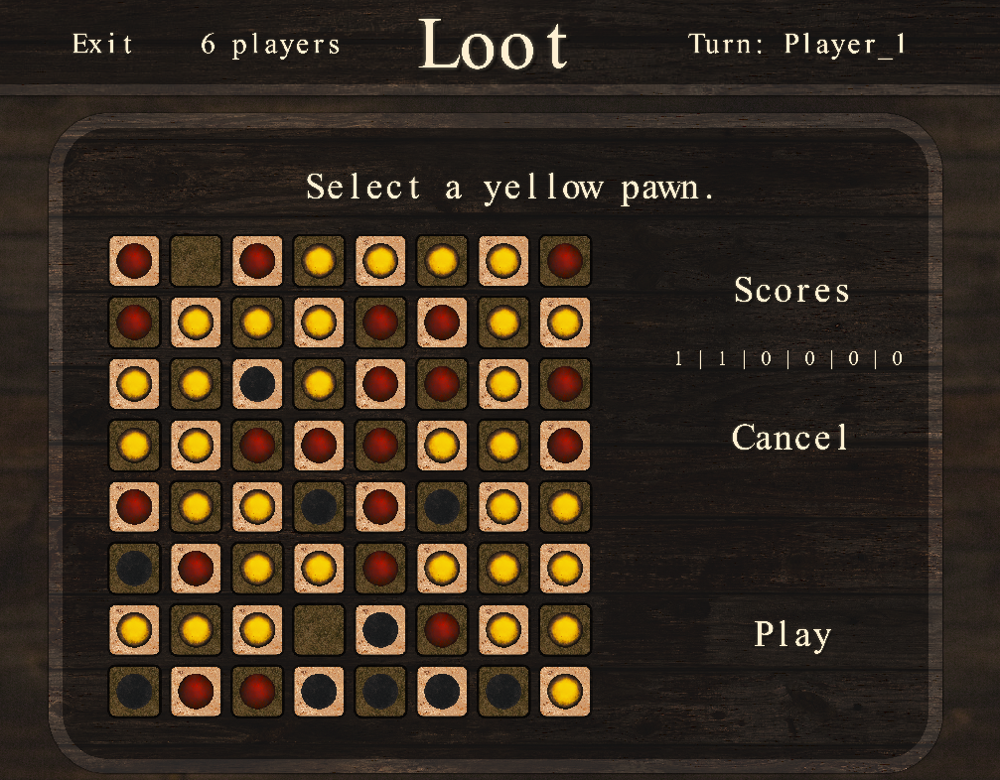
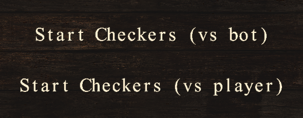
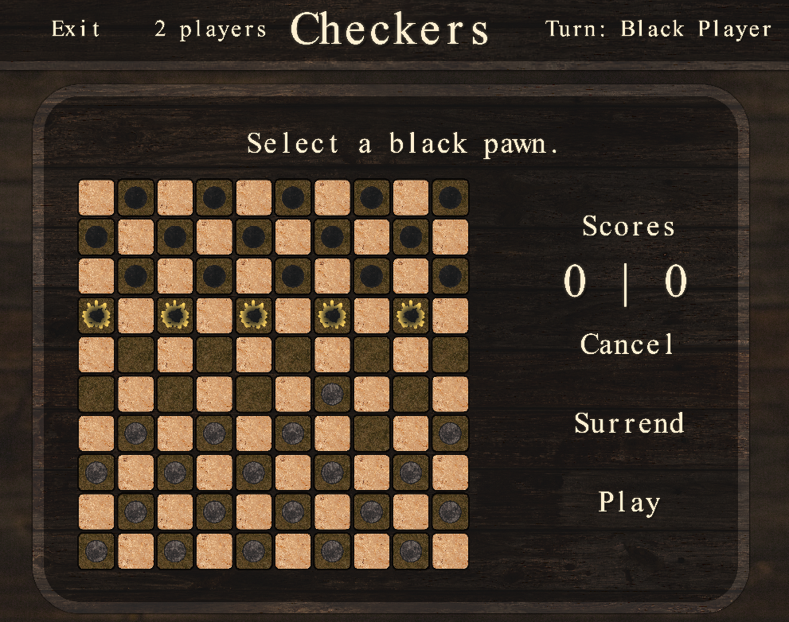
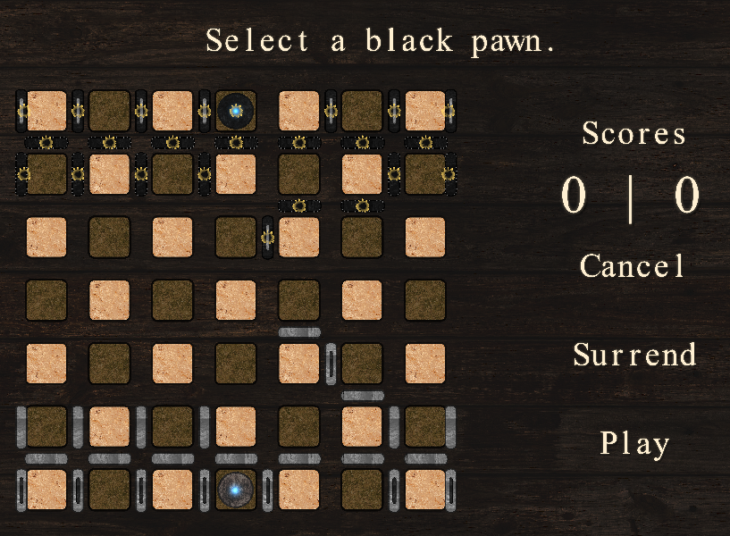

# Board Game 🕹️

Simple c++ interface to play board games against bots or players.\
Games supported :
- **Loot** [(french tutorial for "Butin")](http://jeuxstrategieter.free.fr/Butin_complet.php)
- **Checkers** [(french tutorial for "Dames")](https://infolib.re/storage/files/documents/jeux_de_societe/Les%20dames%20-%20R%C3%A8gle%20du%20jeu.pdf)
- **BullTricker** [(french tutorial for "BullTricker")](http://www.bulltricker.com/fr/regle_simplifiee.html)

## Table
- Introduction
    - [Demo](#demo)
- Setup
    - [Installation](#installation)
    - [Run](#run)
- Functionality
    - [Features](#features)
    - [Architecture](#architecture)
- Future Development
    - [Future Development](#future-development)

## Demo

### Loot
- Select the number of real players and bots before the party
    - 
- Select a yellow pawn and then click on all the cases you want to jump to
    - 
- Game is finished when there is not any action left
    - 

### Checkers

- Choose if you want to play against a bot or a player 
    - 
- On each turn, the pieces that you can use are marked (in yellow)
    - 

### BullTrickers

- Choose if you want to play against bots or players
- On each turn, the pieces that you can use are marked in (yellow)
    - 
    

## Setup
### Installation
Compilation require g++ and sfml installed.\
To install sfml :
```bash
# Ubuntu
sudo apt-get update
sudo apt-get install libsfml-dev
# Fedora
sudo dnf install SFML-devel
# Arch linux
sudo pacman -S sfml
```

Compilation
```bash
make
```
Flags
```bash
make RELEASE=1  # to disable debugging.
make MAC=1      # necessary on MAC OS
```

### Run

```bash
./run
```
or
```bash
make run
```

## Features

- Game Loot
- Game Checkers
- Game BullTricker
- Bot
    - RandomStrategy
        - Pick a random action
    - GreedyStrategy
        - Pick an action the maximise the next turn score
    - AlphaBetaStrategy
        - Only in zero sum 1 vs 1 games (checkers and bulltricker)
        - Maximise score over $n$ parties in the future
            - Assume each player will try to minimize/maximize the player score

## Architecture

This project has an MVC architecture.

- #### Model :
    - Each game have its own implementation of GameState class, Action class
        - a GameState is composed of :
            - a BoardType (inherits Board class)
            - a list of scores
            - its step
            - current player id.
        - ActionType :
            - It requires to implement the following methods
                - ``getActions`` : Get all the actions appliable on a given GameState.
                    - Checkers queen can have a gigantic number of possible actions, so we restrict the actions given for capture
                - ``hasRemainingActions`` : is there any action left ?
                - ``isValid`` : Can the action be applied on a GameState ?
                - ``apply`` : Apply the action onto a GameState.
                - ``actionEquivalence`` : Do the two actions have the same effect over a given GameState?
                
- #### View :
    - The launcher alternates between Menu and Games
        - If Menu.focus is empty, it focuses the Menu
        - If Menu.focus is non empty, it focuses the corresponding Game 
    - Each game have its own implementation of the Game class
        - a Game class is a view for a specific game.
- #### Controller :
    - Each game have its own implementation of Manager class
    - Manager acts as the controller :
        - it initializes the first game state, and it checks if an action is valid before applying it 

## Future Development

- GUI
    - helper for Checkers
    - arrows for Checkers
- BOT
    - MonteCarloStrategy
